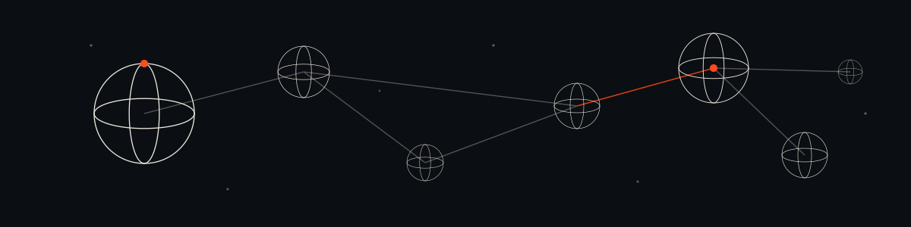
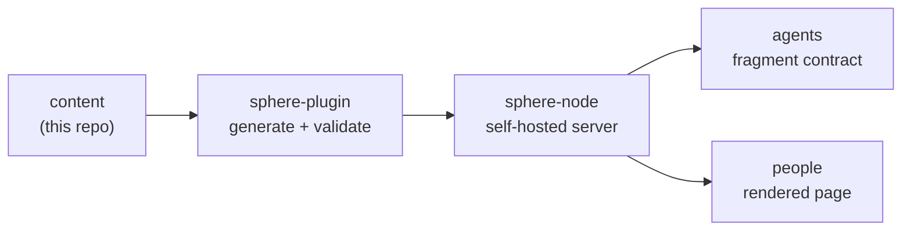

<p align="center">
  
</p>
<h1 align="center">Sphere</h1>
<p align="center">
  <strong>Agent-readable publishing, hosted by you.</strong>
</p>
<p align="center">
  <a href="https://sphere.pub"></a>
  <a href="https://github.com/marianoviola/sphere-node"></a>
  <a href="https://github.com/marianoviola/sphere-plugin"></a>
  
</p>

---

Sphere is a structured access layer for publishing written knowledge to AI agents. It treats a piece of writing not as crawlable text but as a **fragment**: a bounded unit with provenance, license, access policy, and typed relations to other fragments. Agents read the contract; people read a rendered page at the same address.

This repository is the **content source**: the documentation and theory behind Sphere, kept as plain Markdown. It is not a website and not an application. It is the body of writing that becomes agent-readable fragments and gets published to a Sphere Node.

## The system

Sphere is three small pieces and a node that serves itself.



| Repository | Role |
|---|---|
| **sphere** (this repo) | The Markdown content that fragments are made from. |
| [**sphere-node**](https://github.com/marianoviola/sphere-node) | The self-hostable server on Cloudflare Workers. Serves the fragment contract to agents and renders a human-readable surface. One-click deploy. |
| [**sphere-plugin**](https://github.com/marianoviola/sphere-plugin) | The local Claude plugin that prepares and validates fragments from this content. |

The fragment contract is canonical in `sphere-node` under `spec/` (`fragment.schema.json` and `node-api.md`). This repository never redefines it.

## Structure

- `content/` is the documentation and theory, as Markdown. Each file keeps its frontmatter (`title`, `description`, `summary`, a `status` of `shipped`, `mixed`, or `vision`, and an optional `sources` list), useful metadata when generating fragments.
- `content/notes/` holds theory notes, for example why Sphere is named Sphere.

### Sources: typed external provenance

A content file may declare `sources` in its frontmatter: the external works it draws on. Provenance is legitimacy, so it is part of the fragment contract — the plugin copies it through to the fragment `sphere.json`, and the node renders it. It lives in the source frontmatter so it survives regeneration. Each entry has a `type` (`book`, `article`, `paper`, `video`, `webpage`, `dataset`, or `other`) and a `title`, with optional `author`, `url`, `date`, and `note`:

```yaml
sources:
  - type: book
    title: The Structural Transformation of the Public Sphere
    author: Jürgen Habermas
    date: "1962"
```

`sources` is EXTERNAL provenance only — not the internal document a fragment was generated from (that build lineage is captured by `canonical_url`, not the contract). Original, node-native content simply has no `sources`. The canonical schema lives in [`sphere-node/spec/fragment.schema.json`](https://github.com/marianoviola/sphere-node/blob/main/spec/fragment.schema.json); this repo never redefines it.

## Workflow

The content here is the input. Fragments are generated from it with the Claude plugin, validated against the contract, and published to a Sphere Node that the publisher runs themselves. Updating a fragment is republishing it; the node is the home of what is served.

## Read the theory

The concept docs are the best way in:

| Document | What it covers |
|---|---|
| [Concept](content/concept.md) | Why Sphere exists, the public sphere, fragments and constellations, the revenue-model vision. |
| [Format](content/format.md) | What a fragment is, and the shape of its metadata. |
| [HTTP layer](content/http-layer.md) | How content negotiation and the 402 seam work over plain HTTP. |
| [Governance and deployment](content/governance-and-deployment.md) | How nodes, ownership, and publication fit together. |

## See it live

The reference node serves this project's own fragments at **[sphere.pub](https://sphere.pub)**: a human index in the browser, and the fragment contract for agents at `/.well-known/sphere.json`. Sphere publishes itself.

## License

The writing in this repository is the Sphere project by Mariano Viola, an independent project. Published fragments default to CC BY-NC unless a fragment states otherwise. The node and plugin code carry their own licenses in their repositories.
