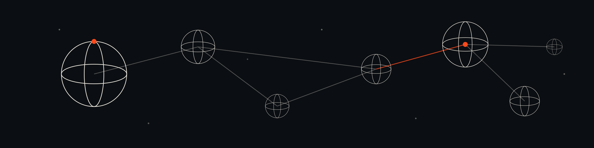

  

# Sphere

This repository is the **content source** for Sphere: the written documentation
and theory, kept as plain Markdown. It is not a website and not an application —
it is the body of writing that Mariano Viola turns into agent-readable
**fragments** (using the Claude plugin) and publishes to a Sphere Node.

The implementation lives in two separate repositories:

- [sphere-node](https://github.com/marianoviola/sphere-node) — the self-hostable
  content server on Cloudflare Workers. It serves the fragment contract to
  agents and renders a human-readable surface.
- [sphere-plugin](https://github.com/marianoviola/sphere-plugin) — the local
  Claude plugin for preparing and validating fragments from this content.

The fragment contract is canonical in `sphere-node` under `spec/`
(`fragment.schema.json` and `node-api.md`). This repository never redefines it.

## Structure

- `content/` — the documentation and theory, as Markdown. Each file keeps its
  frontmatter (`title`, `description`, `summary`, and a `status` of `shipped`,
  `mixed`, or `vision`), which is useful metadata when generating fragments.
- `content/notes/` — theory notes (for example, why Sphere is named Sphere).

## Workflow

The content here is the input. Fragments are generated from it with the Claude
plugin (`sphere-plugin`), validated against the contract, and published to a
Sphere Node (`sphere-node`) that the publisher runs themselves.

## License

The documentation reflects the Sphere project by Mariano Viola. Sphere is an
independent project.
