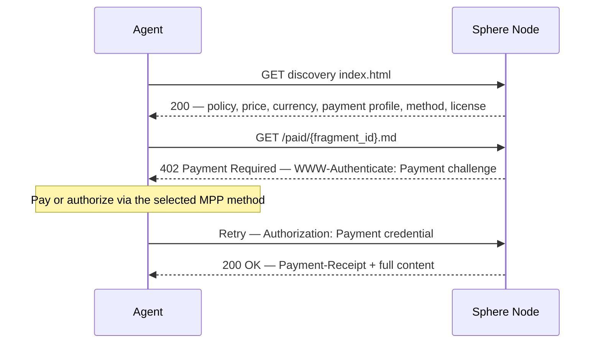
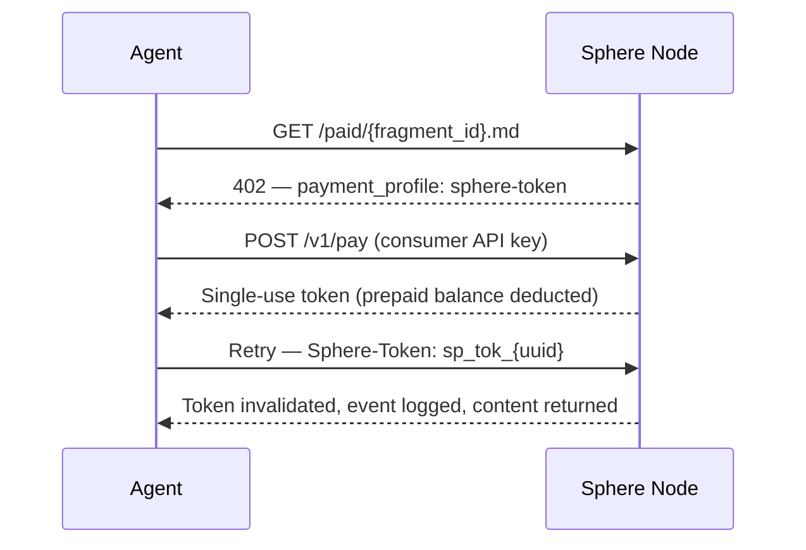

# Payment Flow

> MPP / PaymentAuth integration, Sphere fallback tokens, and payment accounting.

---

## Payment Layer

Sphere does not define a new machine-payment protocol. Paid fragment access should use MPP / PaymentAuth as the default HTTP-native payment layer.

The HTTP 402 status code ("Payment Required") becomes meaningful when paired with the `Payment` HTTP authentication scheme: the server issues a payment challenge in `WWW-Authenticate`, the agent satisfies that challenge, and the retry carries a payment credential in `Authorization`. The server may return `Payment-Receipt` after successful verification.

Sphere adds content semantics around that payment layer: fragment identity, license, attribution, publisher accounting, and contributor revenue distribution.

External references:

- MPP: `https://mpp.dev`
- PaymentAuth specifications: `https://paymentauth.org`

---

## Default Flow — MPP / PaymentAuth



---

## Sphere Fallback Token Flow

Sphere may still expose a prepaid-token fallback for clients that cannot yet speak MPP / PaymentAuth, or for private deployments that want simple prepaid accounting. The token service can be hosted by the publisher's own Sphere Node or delegated to an optional `sphere.pub` payment coordination service.

Fallback flow:



### Token Properties

| Property | Value |
|---|---|
| Format | `sp_tok_{uuid_v4}` |
| TTL | 5 minutes from issuance |
| Usage | Single-use — invalidated immediately on first successful request |
| Scope | Bound to a specific `fragment_id` |
| Storage | Database with `used` flag and `used_at` timestamp |

A token that has been used returns 401 on any subsequent request, even within the TTL window. This token profile is a compatibility mechanism, not the preferred public protocol.

---

## Payment API

### POST /v1/pay

Issues a single-use token after charging the consumer's Sphere prepaid balance. This endpoint is only required for the `sphere-token` fallback profile.

**Request:**
```json
{
  "fragment_id": "string",
  "consumer_id": "string"
}
```

**Response (200):**
```json
{
  "token": "sp_tok_{uuid}",
  "expires_at": "ISO 8601",
  "single_use": true,
  "fragment_id": "string",
  "amount_charged": 0.003,
  "currency": "USD"
}
```

**Error (402 — insufficient balance):**
```json
{
  "error": "insufficient_balance",
  "required": 0.003,
  "balance": 0.001,
  "top_up_url": "https://api.publisher.example/v1/consumers/{id}/top-up"
}
```

---

## Consumer Registration

Agent consumers may register with Sphere to receive an API key and a prepaid credit balance for the fallback token profile. MPP / PaymentAuth clients may instead use their own supported payment method credentials.

```
POST /v1/consumers/register
{
  "name": "string",
  "email": "string",
  "use_case": "rag | agent | research | other"
}
→ { "consumer_id": "string", "api_key": "string" }
```

The prepaid model avoids per-request Stripe charges in the fallback flow. Credits are deducted synchronously from the balance on each `/v1/pay` call.

---

## x402 Compatibility

Sphere's native content model is intentionally payment-protocol agnostic. The same fragment access requirement should expose enough information to map to MPP / PaymentAuth by default and to x402-compatible clients where useful.

The core facts are stable across payment layers: fragment identifier, amount, currency, license, payment intent, expiry, and proof or receipt semantics.

---

## Metered Policy — Preview

For fragments with `policy: metered`, the first `preview_chars` characters are returned with a 200 before payment is requested. The 402 is returned only when the full content is requested.

Implementation: the Worker checks the `Range` header or a `?full=true` query parameter. If absent, it serves the preview from R2 and returns 200. If present and no valid payment credential or fallback token, it returns 402.

---

## Security Considerations

- API keys are stored hashed, never in plaintext
- Tokens are single-use and short-lived (5 min TTL)
- Payment endpoint is rate-limited per consumer (max 60 req/min)
- All payment events are logged append-only for reconciliation
- Idempotency key support on `/v1/pay` to prevent double-charging on retry
