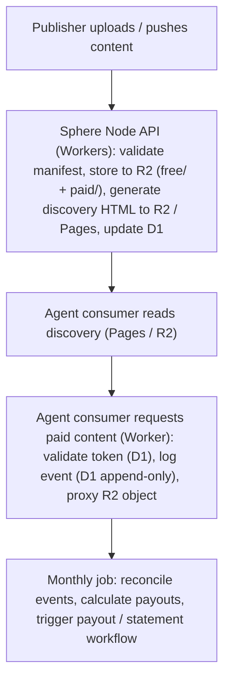
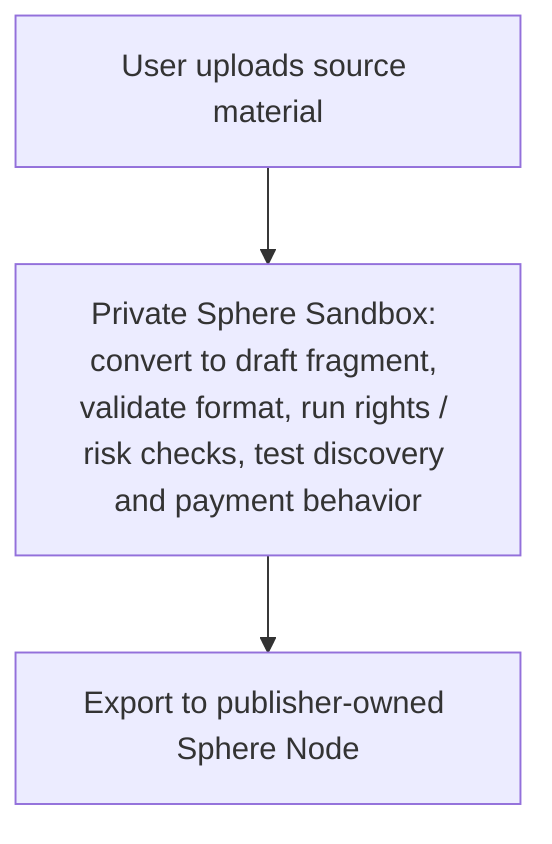

# Infrastructure

> Stack, Cloudflare components, and deployment architecture.

---

## Overview

The reference Sphere Node is built on Cloudflare infrastructure. A publisher deploys the node in its own Cloudflare account or an equivalent self-hosted environment.

`sphere.pub` may provide a private sandbox for draft preparation and testing. That sandbox is not the same as public fragment hosting: sandbox fragments are private, quota-limited, not monetized, not publicly registered, and exportable to a publisher-owned Sphere Node.



Optional sandbox flow:



---

## Cloudflare Components

| Component | Purpose |
|---|---|
| **Workers** | Payment API, paid content gate, fragment ingestion pipeline |
| **R2** | Content storage — `free/` (public), `paid/` (private, Worker-gated) |
| **Pages** | Discovery layer — static HTML, always 200, globally cached |
| **D1** | Relational database — fragments, tokens, events, consumers, publishers |
| **Queues** | Async event processing — consumption events, payout jobs |
| **KV** | Token cache — fast single-use token validation |
| **Access** | Publisher API authentication (service tokens) |

The reference stack uses no VPS or application server. The serving stack is serverless, but the protocol should remain portable to other infrastructure.

---

## R2 Storage Structure

```
sphere-content/
  free/
    {fragment_id}.md
  paid/
    {fragment_id}.md
  media/
    {fragment_id}/
      {filename}

sphere-discovery/
  {publisher_id}/
    index.html
    {series_id}/
      index.html
      {fragment_id}/
        index.html
        sphere.json
```

`sphere-discovery` is bound to a Cloudflare Pages project and served publicly.
`sphere-content` free path is public R2-backed storage.
`sphere-content` paid path is private — only accessible via the Worker.

---

## D1 Schema (core tables)

```sql
-- Fragments registry
CREATE TABLE fragments (
  id TEXT PRIMARY KEY,           -- fragment_id (slug)
  publisher_id TEXT NOT NULL,
  series_id TEXT,
  policy TEXT NOT NULL,          -- free | metered | paid | sponsored
  price_per_access REAL,
  currency TEXT DEFAULT 'USD',
  language TEXT,
  title TEXT,
  word_count INTEGER,
  published_at DATETIME,
  updated_at DATETIME,
  removed_at DATETIME            -- soft delete → returns 410
);

-- Append-only consumption log
CREATE TABLE events (
  id INTEGER PRIMARY KEY AUTOINCREMENT,
  fragment_id TEXT NOT NULL,
  consumer_id TEXT NOT NULL,
  event_type TEXT NOT NULL,      -- fragment_discovered | preview_served | payment_challenged | content_unlocked
  token TEXT,
  payment_challenge_id TEXT,
  payment_receipt TEXT,
  payment_profile TEXT,          -- mpp-paymentauth | sphere-token | x402
  amount REAL,
  currency TEXT DEFAULT 'USD',
  stripe_payment_intent TEXT,
  created_at DATETIME NOT NULL
  -- no updated_at: append-only
);

-- Append-only revenue attribution log
CREATE TABLE revenue_entries (
  id INTEGER PRIMARY KEY AUTOINCREMENT,
  event_id INTEGER NOT NULL,
  fragment_id TEXT NOT NULL,
  publisher_id TEXT NOT NULL,
  gross_amount REAL NOT NULL,
  sphere_fee REAL NOT NULL,
  publisher_net REAL NOT NULL,
  currency TEXT DEFAULT 'USD',
  status TEXT NOT NULL,          -- pending | settled | paid_out | reversed
  created_at DATETIME NOT NULL,
  FOREIGN KEY(event_id) REFERENCES events(id)
);

-- Single-use tokens
CREATE TABLE tokens (
  token TEXT PRIMARY KEY,
  fragment_id TEXT NOT NULL,
  consumer_id TEXT NOT NULL,
  amount_charged REAL,
  stripe_payment_intent TEXT,
  used INTEGER DEFAULT 0,
  expires_at DATETIME NOT NULL,
  used_at DATETIME
);

-- Consumers
CREATE TABLE consumers (
  id TEXT PRIMARY KEY,
  name TEXT,
  api_key_hash TEXT NOT NULL,
  stripe_customer_id TEXT,
  balance REAL DEFAULT 0,
  age_verified INTEGER DEFAULT 0,
  created_at DATETIME
);

-- Publishers
CREATE TABLE publishers (
  id TEXT PRIMARY KEY,
  name TEXT,
  stripe_account_id TEXT,
  payout_minimum REAL DEFAULT 10,
  payout_frequency TEXT DEFAULT 'monthly',
  created_at DATETIME
);
```

---

## Worker — Paid Content Gate

```javascript
// workers/paid-gate.js
export default {
  async fetch(request, env) {
    const paymentCredential = request.headers.get('Authorization')?.startsWith('Payment ')
      ? request.headers.get('Authorization')
      : null;
    const token = request.headers.get('Sphere-Token');
    const fragmentId = new URL(request.url).pathname.split('/paid/')[1]?.replace('.md', '');

    if (!fragmentId) return new Response('Not Found', { status: 404 });

    if (paymentCredential) {
      const receipt = await verifyPaymentCredential(paymentCredential, fragmentId, env);
      if (!receipt.valid) return paymentRequiredResponse(fragmentId);

      env.EVENT_QUEUE.send({
        type: 'access_paid',
        fragmentId,
        consumerId: receipt.consumer_id,
        paymentProfile: 'mpp-paymentauth',
        paymentReceipt: receipt.id
      });

      return serveFragment(fragmentId, env, receipt.id);
    }

    if (!token) return paymentRequiredResponse(fragmentId);

    // Fallback token check via KV
    const cached = await env.TOKEN_KV.get(token);
    if (!cached) return new Response(JSON.stringify({ error: 'invalid_token' }), {
      status: 401, headers: { 'Content-Type': 'application/json' }
    });

    const tokenData = JSON.parse(cached);
    if (tokenData.used || tokenData.fragment_id !== fragmentId) {
      return new Response(JSON.stringify({ error: 'invalid_token' }), {
        status: 401, headers: { 'Content-Type': 'application/json' }
      });
    }

    // Mark token used (KV + async D1 write)
    await env.TOKEN_KV.delete(token);
    env.EVENT_QUEUE.send({
      type: 'access_paid',
      fragmentId,
      token,
      consumerId: tokenData.consumer_id,
      paymentProfile: 'sphere-token'
    });

    return serveFragment(fragmentId, env);
  }
};

async function serveFragment(fragmentId, env, receiptId) {
  const object = await env.CONTENT_R2.get(`paid/${fragmentId}.md`);
  if (!object) return new Response('Not Found', { status: 404 });

  const headers = { 'Content-Type': 'text/markdown; charset=utf-8' };
  if (receiptId) headers['Payment-Receipt'] = receiptId;

  return new Response(object.body, { headers });
}
```

---

## Ingest Pipeline

Three trigger types for fragment ingestion:

| Type | Trigger | Notes |
|---|---|---|
| Direct upload | `POST /v1/fragments` with multipart | Simplest, v0.1 |
| Git webhook | GitHub/GitLab push event | v0.2 |
| S3/R2 notification | Object storage event | v0.2 |

All three converge on the same Worker pipeline: validate manifest → store to R2 → generate discovery HTML → update D1.

---

## Cost Model (estimated)

At 100,000 paid accesses/month:

| Component | Cost |
|---|---|
| Workers requests | ~$0.15 |
| R2 storage (10GB) | ~$0.15 |
| R2 operations | ~$0.50 |
| D1 reads/writes | ~$0.10 |
| KV operations | ~$0.05 |
| **Total infra** | **~$1.00/month** |

Revenue at $0.003/request × 100,000 = $300/month.
Infrastructure cost: <0.5% of revenue.
